# Steps to Implement Into DFP

# Index

- [1. Prepare Hike-DFP tag](#HikeTag)
- [2. Set ad unit](#unit)
- [3. Set order](#order)
  - [3-1. In "Advertiser", select "Add a new company"](#order1)
  - [3-2. Input Name and Sizes](#order2)
  - [3-3. Set delivery schedule/delivery rate/goal](#order3)
  - [3-4. Select "Save and Upload creatives"](#order4)
- [4. Set creative](#creative)
- [5. Create DFP tag](#DFPTag)
  - [5-1. Select ad unit](#DFPTag1)
  - [5-2. Select tag type (Web/App)](#DFPTag2)
  - [5-3. Set tag options](#DFPTag3)
  - [5-4. Tag will be generated](#DFPTag4)
- [6. Implement DFP tag](#ImplementTag)
- [7. Start delivery](#delivery)

# 1. Prepare Hike-DFP tag
Create Hike tag for DFP with the documents below.

https://github.com/mtburn/MTBurn-JavaScript-SDK-Install-Guide/blob/master/Programming_Guide.md#dfp

# 2. Set ad unit
In "Inventory" > "New ad unit", input the basic information and the fixed sizes that determines the ad unit's ad sizes (e.g. 300×250).
When using in-feed, selecting any size would be okay.

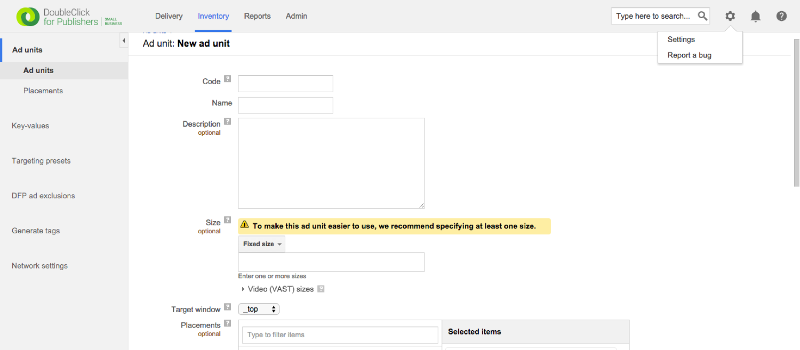

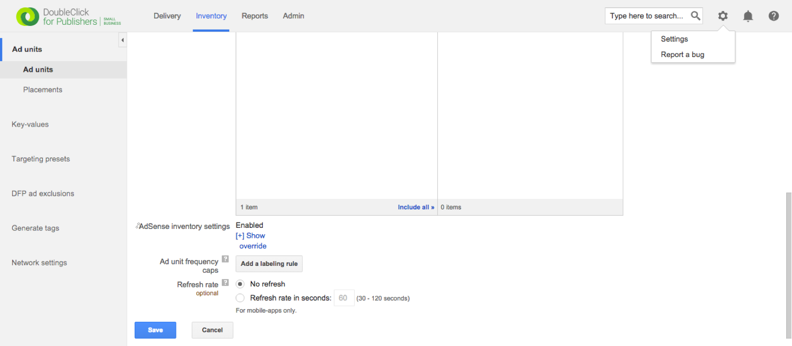

# 3. Set order
In "Delivery" > "New order", set the ad delivery settings.

## 3-1. In "Advertiser", select "Add a new company"

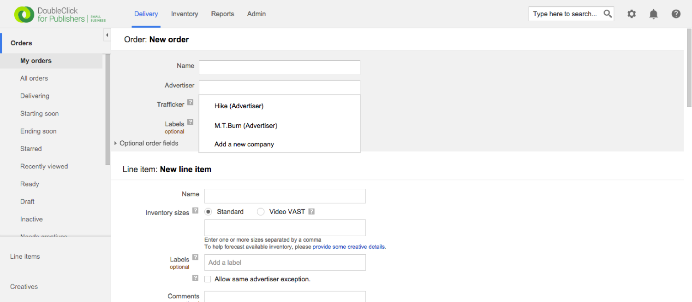

## 3-2. Input Name and Sizes
Select the same "Inventory sizes" that you selected when you created the ad units in the previous step.

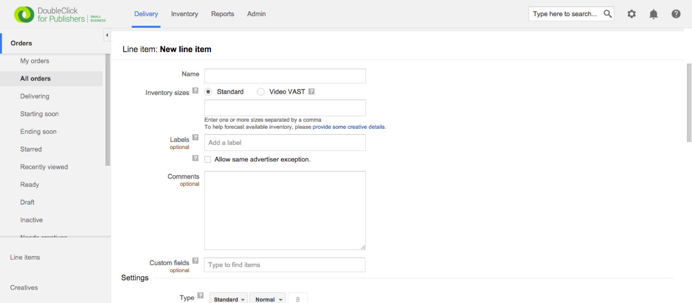

## 3-3 Set delivery schedule/delivery rate/goal
Select "Network" for "Type", and set the goal as "100".

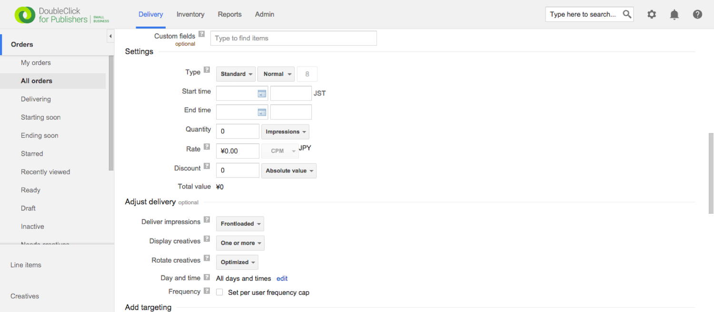

## 3-4 Select "Save and Upload creatives"

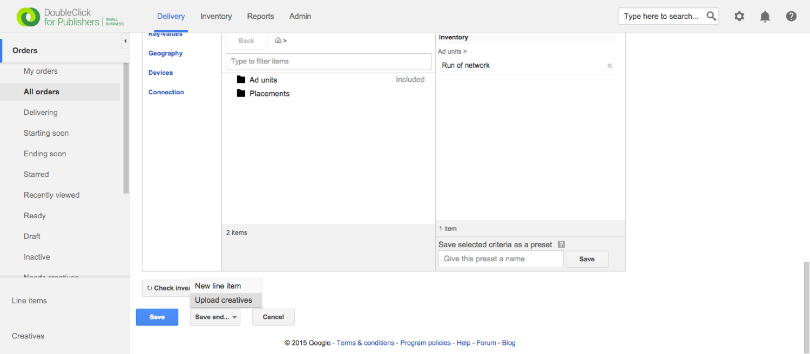

# 4. Set creative
Upload creatives at the end of the order setting, or you can also come in "Delivery" > "Creative".

Select "Third Party". Make sure not to select "Native".

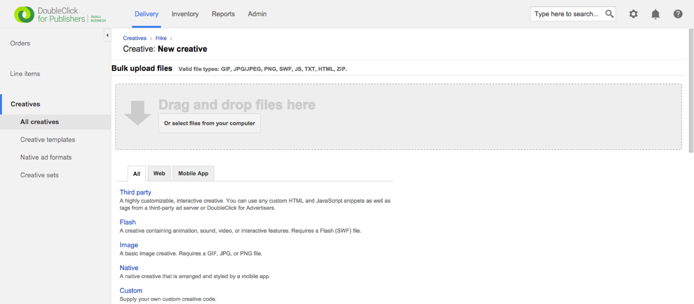

Here, you upload the Hike DFP Tag.

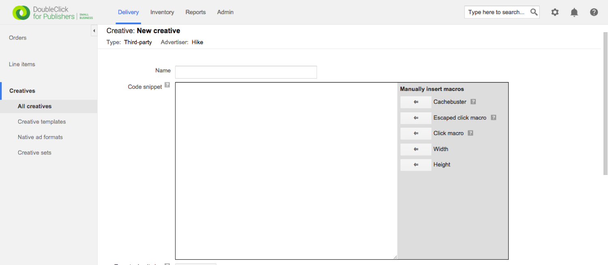

Save. make sure not to check "safeframe". (Recommended)

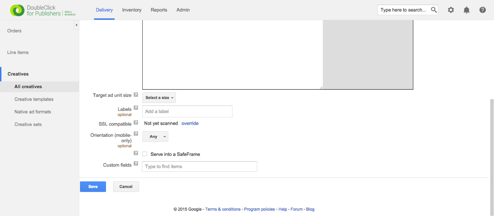

If you check “saferame” , when our ads cannot fill inventory, the empty space will be appear. And if you don’t want to show empty space with safeframe, please set limitation of daily impression.

# 5. Create DFP tag

A. How to generate tag for fixed size ( e.g. 300x250)
In "Inventory" > "Generate tags", generate DFP tag.

## 5-1. Select ad unit

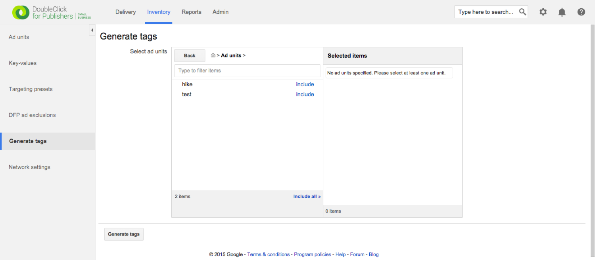

## 5-2. Select tag type (Web/App)
Select "Google publisher tag"

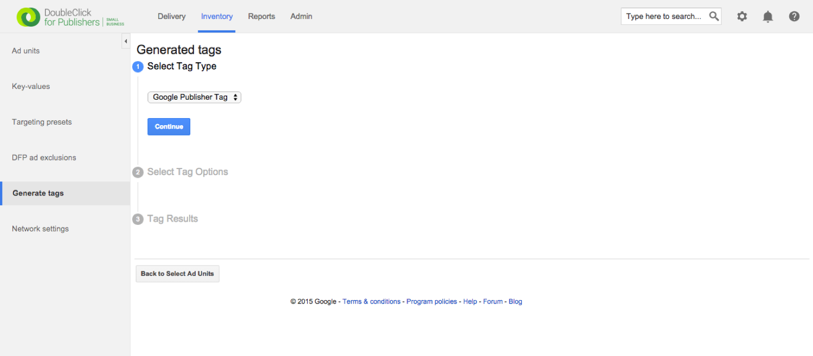

## 5-3. Set tag options
select "Create passback tag" and then "Standard GPT syntax".

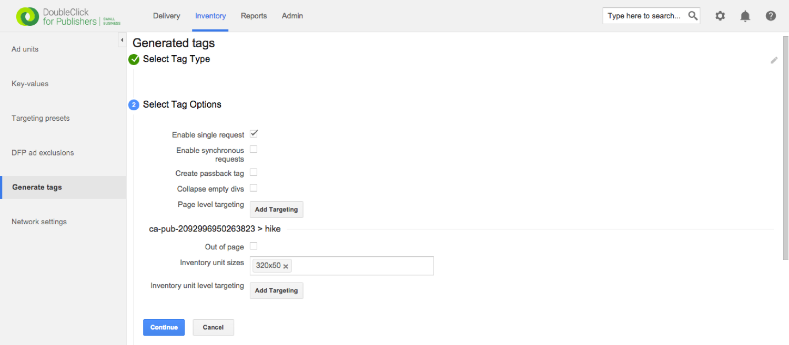

## 5-4. Tag will be generated

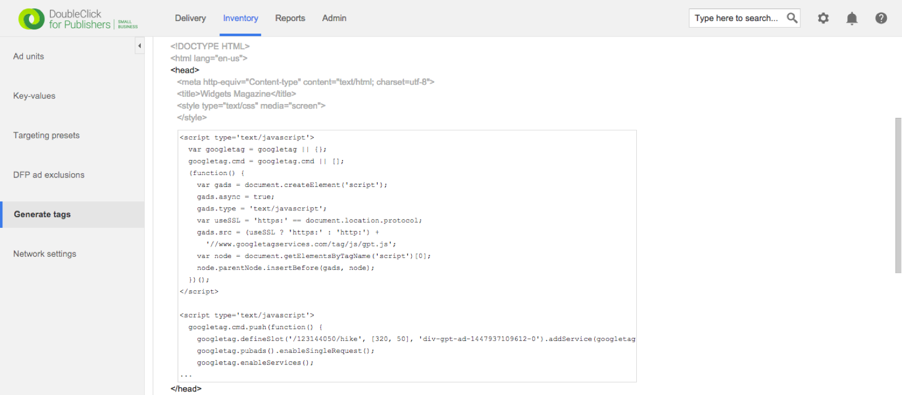

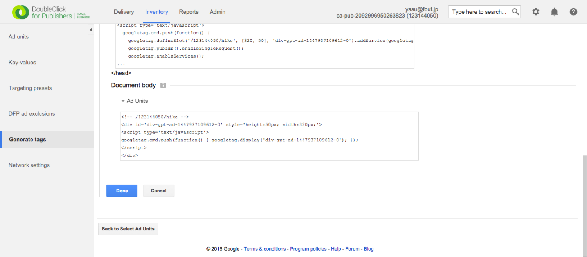

Also refer this.
https://support.google.com/dfp_premium/answer/177207?hl=en

# 6. Implement DFP tag
Implement tag into your site according to guideline on DFP.

# 7. Start delivery
It seems it takes some time and a few reloads for the request to be sent and for the ad to be shown.

Let's monetise with FreakOut !!
