# 目次
- [事前に準備するもの](#prerequisite)
 - [広告枠IDを準備する](#prerequisite1)
- [WordPressプラグインのインストール](#install)
 - [プラグインをインストールする](#install1)
   - [WordPress管理画面上でプラグイン検索してインストールする方法](#install1-1)
   - [プラグインのZIPファイルを指定してインストールする方法](#install1-2)
   - [サーバに直接アップする方法](#install1-3)
 - [プラグインを有効にする](#install2)
 - [「Advanced Ads Pro」 の購入方法](#install3)
- [「Ad Inserter」プラグインで広告を表示する (無料)](#setup1)
 - [広告表示実行コードを登録 - 「Ad Inserter」の共通設定](#setup1-1)
 - [広告を title と content の間に出力する方法 (テーマ編集なし)](#setup1-2)
   - [広告設置位置指定タグの設定](#setup1-2-1)
 - [広告を post と post の間に出力する方法 (テーマ編集あり)](#setup1-3)
   - [広告設置位置指定タグの設定](#setup1-3-1)
   - [テンプレートへのコードの追加](#setup1-3-2)
- [「Advanced Ads Pro」で広告を表示する (有料)](#setup2)
 - [広告を post と post の間に出力する方法 (テーマ編集なし)](#setup2-1)
   - [広告設置位置指定タグの設定](#setup2-1-1)


# 目的
- WordPress にプラグインを用いてインフィード広告を導入する方法を説明します。
- 紹介するプラグインは「Ad Inserter」と「Advanced Ads Pro(有料版)」になります。
- プラグインのインストール方法は「Ad Inserter」のみで解説しますが基本作業はどちらも同じです。

<a name="prerequisite"></a>
# 事前に準備するもの

<a name="prerequisite1"></a>
## 広告枠IDを準備する
- 管理画面で広告枠の新規登録を行い``広告枠 ID`` を１つ準備してください。


<a name="install"></a>
# WordPressプラグインのインストール

<a name="install1"></a>
## プラグインをインストールする

- 一般的なやり方は下記の3通りになります。
- 以下、「Ad Inserter」を例にしていますが、「Advanced Ads」の場合も名前を変えて同じ手順を行います。

<a name="install1-1"></a>
### WordPress管理画面上でプラグイン検索してインストールする方法

- WordPress管理画面の「プラグイン＞新規追加」で「ad inserter」を検索します。
- Igor Funa作の「Ad Inserter」を「いますぐインストール」でインストールします。

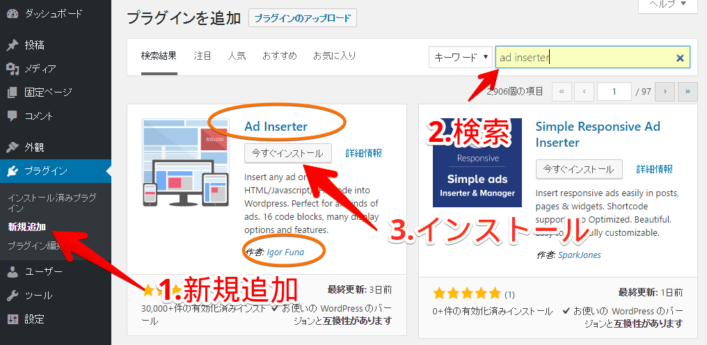

<a name="install1-2"></a>
### プラグインのZIPファイルを指定してインストールする方法

- [WordPressプラグイン「Ad Inserter」](https://wordpress.org/plugins/ad-inserter/)からプラグインのZIPファイルをダウンロードします。
- WordPress管理画面の「プラグイン＞新規追加」で「プラグインのアップロード」を選択します。
- プラグインのZIPファイルを指定して「いますぐインストール」でインストールします。

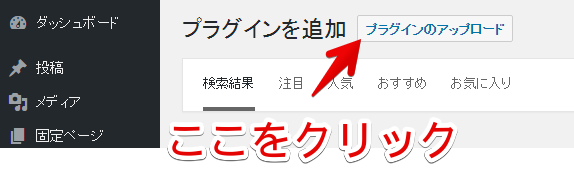

「プラグインのアップロード」を選択すると下図のように展開します。

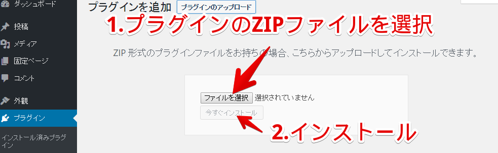

<a name="install1-3"></a>
### サーバに直接アップする方法

- [WordPressプラグイン「Ad Inserter」](https://wordpress.org/plugins/ad-inserter/)からプラグインのZIPファイルをダウンロードします。
- ZIPファイルを解凍したディレクトリの中に「ad-inserter」という名前のディレクトリができます。
- 「ad-inserter」ディレクトリを WordPressがインストールされているディレクトリの `wp-contents/plugins`ディレクトリにアップロードします。
 - アップロードにはFTPアプリケーションなどをご利用ください。


<a name="install2"></a>
## プラグインを有効にする

- WordPress管理画面の「プラグイン＞インストール済みプラグイン」を押してください。
- Ad Inserter を「有効」にしてください。

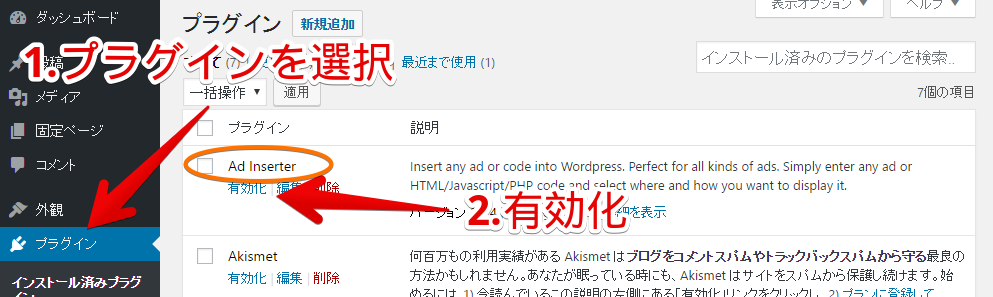

<a name="install3"></a>
## 「Advanced Ads Pro」 の購入方法

- WordPress管理画面の「Advanced Ads ＞ Advansed Ads」を押してください。
- Get Pro を押してください。
- 遷移先のサイトより Advanced Ads Pro プラグインを購入してください。

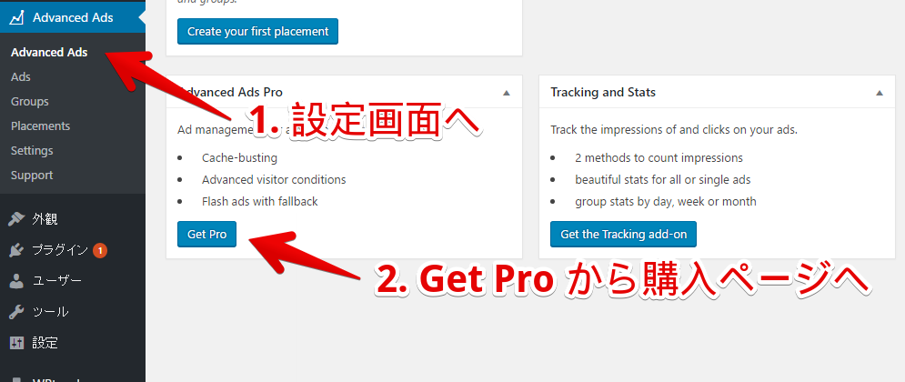


<a name="setup1"></a>
# 「Ad Inserter」プラグインで広告を表示する (無料)

<a name="setup1-1"></a>
## 広告表示実行コードを登録 - 「Ad Inserter」の共通設定

WordPress管理画面の「設定＞Ad Inserter」から登録を行います。

1. Tab「16」の右にある「ツールボタンタブ」をクリックします。
2. 設定画面のタブから「Footer」をクリックします。
3. Enable にチェックを入れ以下2行を追加します。
```html
<script src="http://js.mtburn.com/advs-instream.js"></script>
<script type="text/javascript">MTBADVS.InStream.Default.run({immediately:true})</script>
```
4. 「Save Settings」をクリックします。

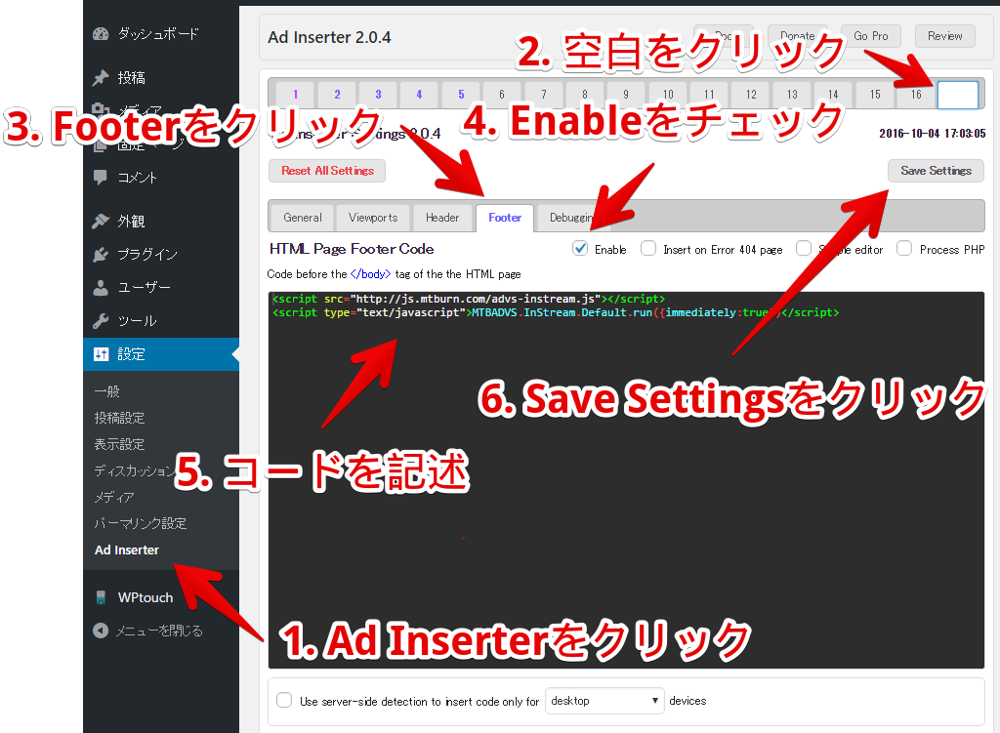

** 広告を表示する事前の準備が整いました。 **

<a name="setup1-2"></a>
## 広告を title と content の間に出力する方法 (テーマ編集なし)

<a name="setup1-2-1"></a>
### 広告設置位置指定タグの設定

WordPress管理画面の「設定＞Ad Inserter」からコードを登録してください。
- Automatic Display に 「Before Content」 を選択します。
- Postsにチェックを入れ「On all」を選択します。
- Block Aliggnment に 「No Wrapping」 を選択します。
- 「Homepage」, 「Category」, 「Search page」, 「Tag/Archive pages」 をチェックします。
- 広告コードを登録します。`広告枠ID` の部分には管理画面で発行した[広告枠ID](#prerequisite1)を入力してください。
```html
<div data-advs-adspot-id="広告枠ID" style="display:none"></div>
```
- 「Save All Settings」を押して登録を完了してください

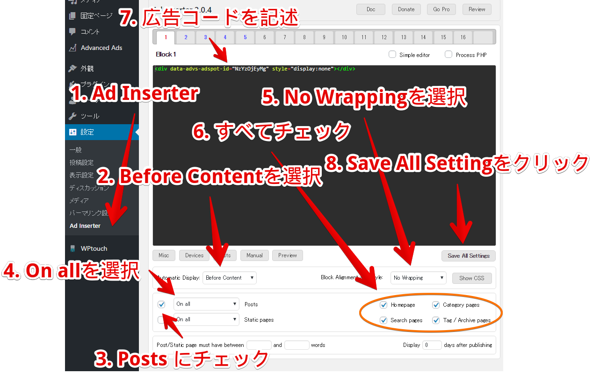

**Ad Inserter の title と content の間に出力する設定は完了です。**

一覧ページで title と content の間に広告が表示されているかを確認してください。


<a name="setup1-3"></a>
## 広告を post と post の間に出力する方法 (テーマ編集あり)

<a name="setup1-3-1"></a>
### 広告設置位置指定タグの設定

WordPress管理画面の「設定＞Ad Inserter」からコードを登録してください。
- 「Manual」を選択します。
- Automatic Display に 「None」 を選択します。
- Postsにチェックを入れ「On all」を選択します。
- Block Aliggnment に 「No Wrapping」 を選択します。
- 「Homepage」, 「Category」, 「Search page」, 「Tag/Archive pages」 をチェックします。
- 広告コードを登録します。`広告枠ID` の部分には管理画面で発行した[広告枠ID](#prerequisite1)を入力してください。
```html
<div data-advs-adspot-id="広告枠ID" style="display:none"></div>
```
- 「PHP function」をチェックします。
- 「PHP function」の右のコードをメモします。
 - 例 `if (function_exists('adinserter')) echo adinserter(1);`
- 「Save All Settings」を押して登録を完了してください
- 完了後、一覧ページで post と post の間に広告が表示されているかを確認してください。

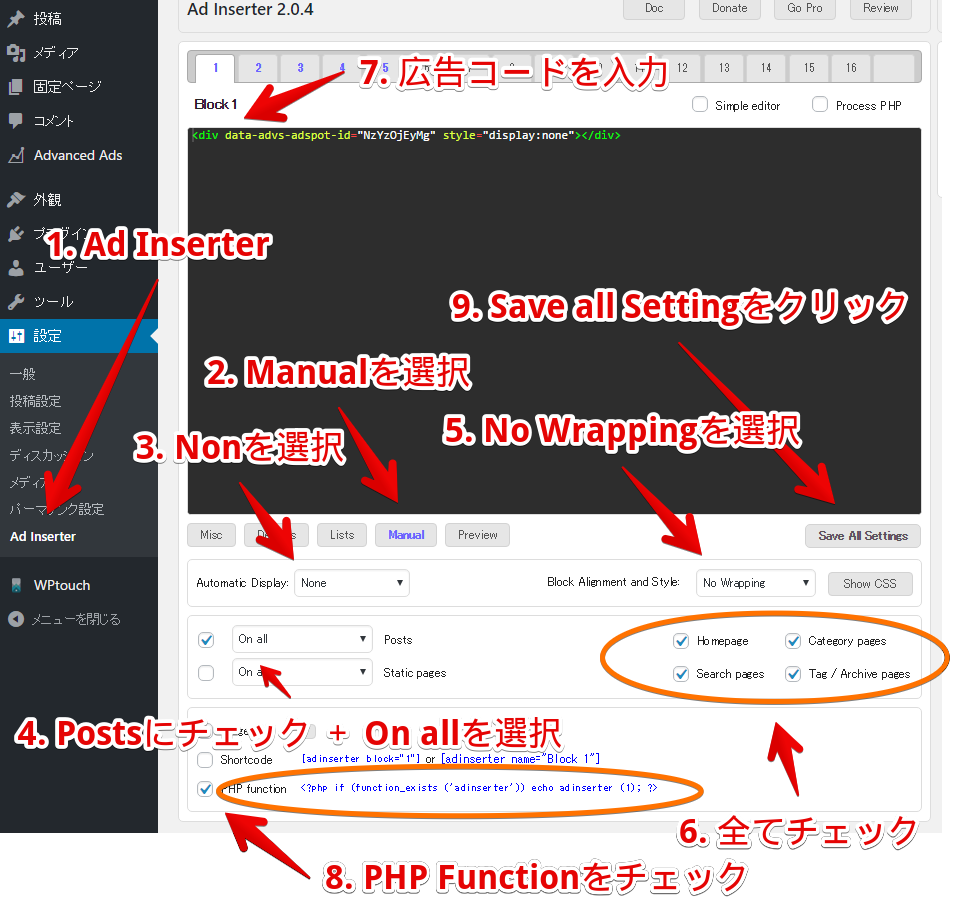

同じフィード内にさらに広告を設置する場合は必要個数分追記してください。

<a name="setup1-3-2"></a>
### テンプレートへのコードの追加

テーマを編集し、広告を表示させたいフィード部分にコードを追加します。

例として、WordPressインストール初期状態のフィード一覧ページのテンプレートは以下の 4 つですがテーマによっては存在しないテンプレートもあります。

- メインインデックステンプレート (``index.php``)
- 検索結果テンプレート (``search.php``)
- アーカイブテンプレート (``archive.php``)
- カテゴリーテンプレート (``category.php``)

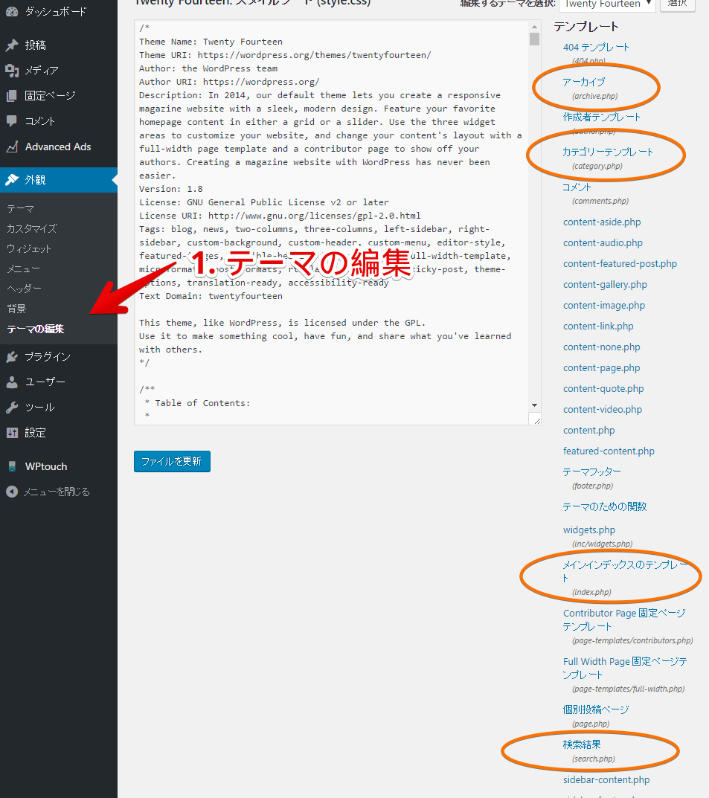


- WordPress管理画面の「外観＞テーマの編集」で、編集するテンプレート(``index.php``や``search.php``、``archive.php``、``category.php`` など)を選択してください
- 下記を参考に 1 行のコードを追加してください
  - ループの終了直前の行に [広告設置位置指定タグの設定](#setup1-3-1) でメモしたコードを追加してください
    - 例 `if (function_exists('adinserter')) echo adinserter(1);`
- 「Save All Settings」を押してテンプレートの編集を終了してください

`index` のテンプレートにコードを追加する例

```php
// Start the loop.
while ( have_posts() ) : the_post();

      /*
       * Include the Post-Format-specific template for the content.
       * If you want to override this in a child theme, then include a file
       * called content-___.php (where ___ is the Post Format name) and that will be used instead.
       */
      get_template_part( 'template-parts/content', get_post_format() );

      if (function_exists ('adinserter')) echo adinserter (1);  // ここに追加

// End the loop.
endwhile;
```


**Ad Inserter の post と post の間に出力する設定は完了です。**

変更したテンプレートの画面で、インフィード広告が表示されるかご確認ください。


<a name="setup2"></a>
# 「Advanced Ads Pro」で広告を表示する場合 (有料)

- Advanced Ads Proを購入し有効化してください

<a name="setup2-1"></a>
## 広告を post と post の間に出力する方法 (テーマ編集なし)

- Advanced Ads Proでの広告表示の解説は管理画面を使ったもののみです

<a name="setup2-1-1"></a>
### 広告設置位置指定タグの設定

- 「管理画面>Advanced Ads>Ads」をクリックしてください
- New Ad をクリックしてください
- クリック後、ウィザード形式での設定となります

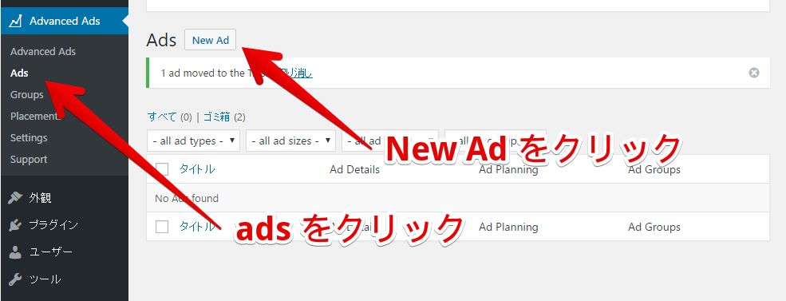

- Adsタイトル
 - Adsタイトルを記入してください（例では myads を記入）
 - next をクリックしてください

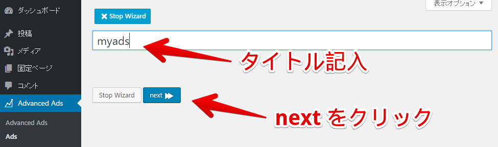

- 挿入広告の記述タイプ
 - Plain Text and Code を選択します
 - next をクリックしてください

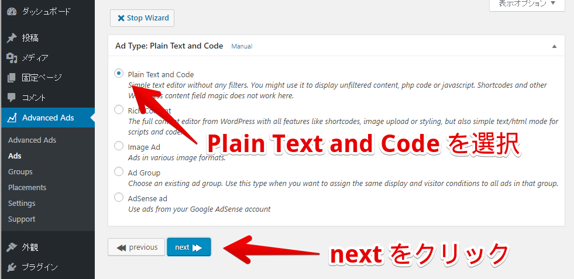

- コード設定
 - 以下のコードを記入してください。
 - 「広告枠ID」には [広告枠IDを準備する](#prerequisite1) で準備したものを記入してください。

```html
<div data-advs-adspot-id="広告ID" style="display:none"></div>
<script src="http://js.mtburn.com/advs-instream.js"></script>
<script type="text/javascript">MTBADVS.InStream.Default.run({immediately:true})</script>
```
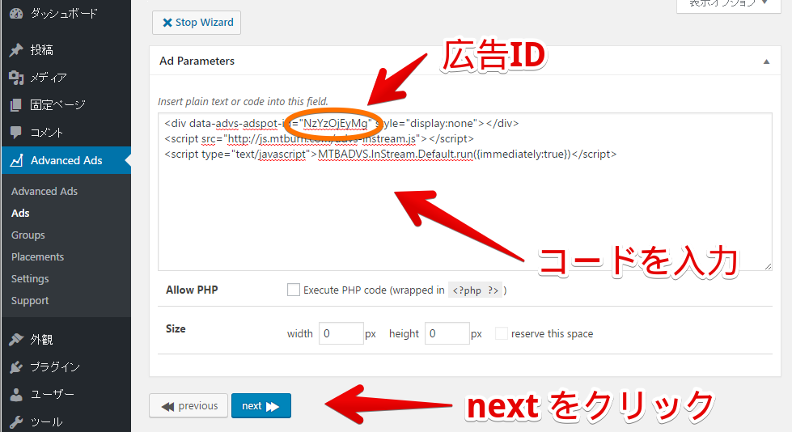

- レイアウト設定
 - Position にdefaultを選択します
 - Margin には記入しません
 - next をクリックしてください

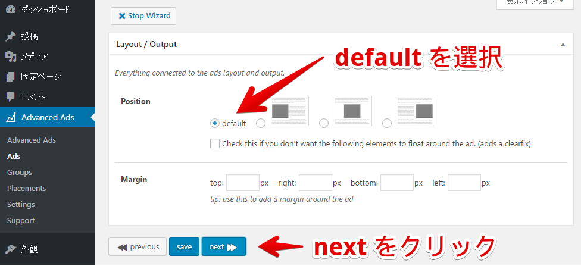

- 表示ページ設定
 - General Conditions に Home Page, Archive Pages, Search Results が含まれている事を確認してください
 - Category 及び他に一覧ページが存在するテーマではそれらも add してください
 - next をクリックします

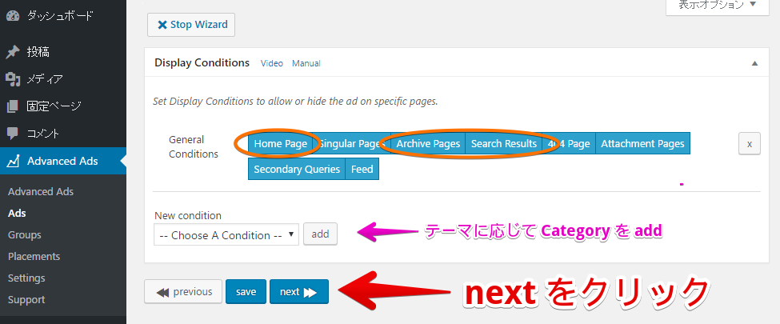

- ユーザー表示設定
 - 全訪問者に広告を表示する場合何も追加しないでください
 - save をクリックしてください

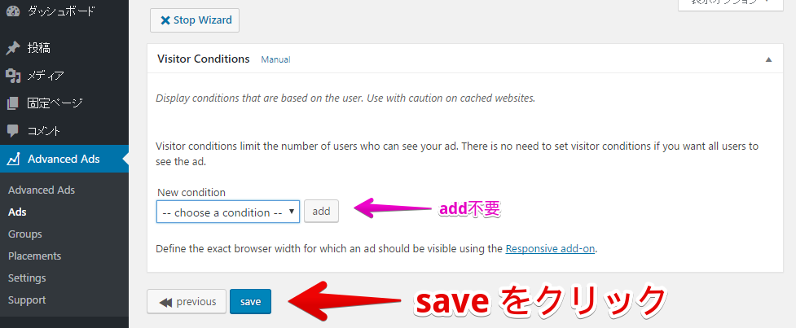

- 表示位置設定1
 - Post List を選択してください
 - 下部のテキストボックスにはPlacement名でads名がデフォルトで入っていますが変更しても問題ありません
 - next をクリックします

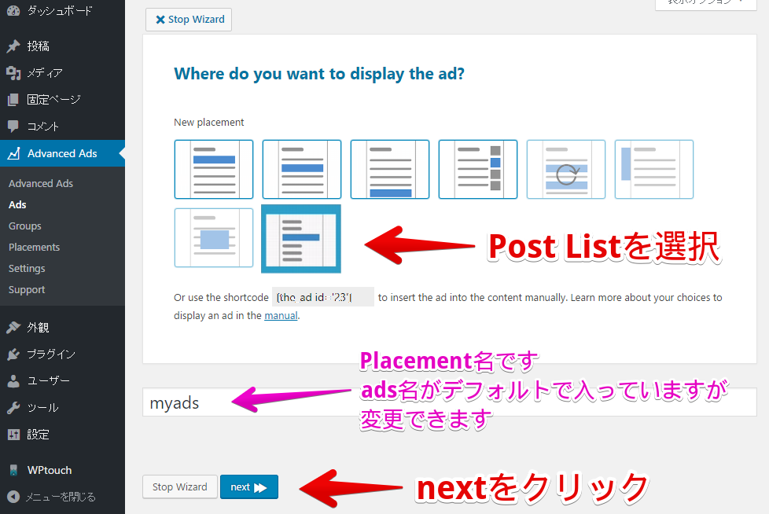

- 表示位置設定2
 - 「管理画面>Advanced Ads Pro>Placements」へ移動します
 - 先ほど作成したPlacementがリストにあります
 - Inject Before は何番目の post の前にこの広告を出すかを設定します
 - 2 を選択してください
 - Save Placements をクリックします
 - 1つ目の広告枠の登録が終わりました

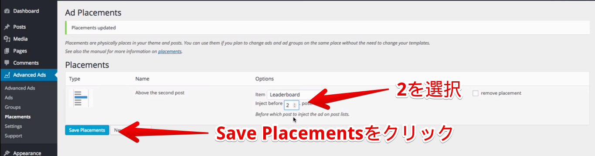

- 表示位置設定3 (2個目から9個目までの表示設定)
 - 「管理画面>Advanced Ads>Placements」を表示します
 - New Placement をクリックします
 - Choose a placement type に Post List を選択します
 - Choose a Name にPlacemnetの名称を記入します
   - 表示する広告の個数分名称が必要になります
   - 例 myads2 ・・・ myads10 etc..
 - Choose the Ad or Group に最初に作成した広告のタイトルを選択します
   - 例 myads
 - Save New Placement をクリック
 - クリック後、Placementsの一覧に追加されるので Inject before に前の番号の次の番号を選択して Save Placements をクリックしてください

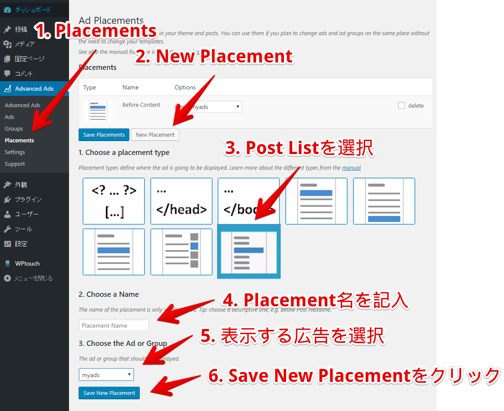

- 「表示位置設定3」を 7 回繰り替えします
- Wordpressのデフォルト一覧表示のpost数は10のため9個のPlacement設定で一覧をカバーできます


参考: リストページでの広告表示の方法を詳しく解説しています。(動画あり・英語) [Post Lists Placement](https://wpadvancedads.com/manual/placement-post-lists/)

**Advanced Ads Pro の post と post の間に出力する設定は完了です。**

変更したテンプレートの画面で、インフィード広告が表示されるかご確認ください。
