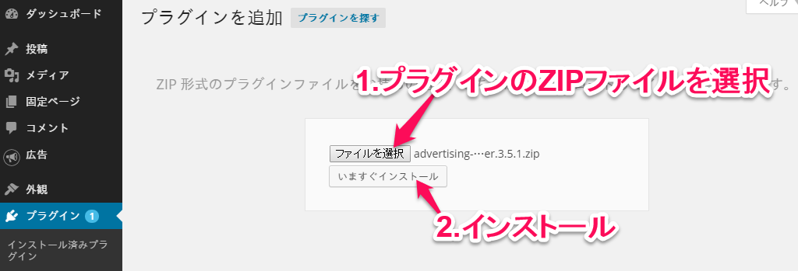
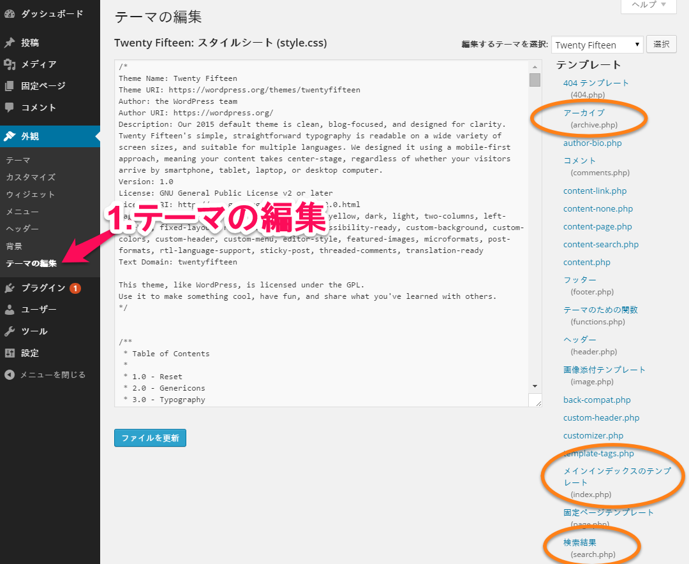
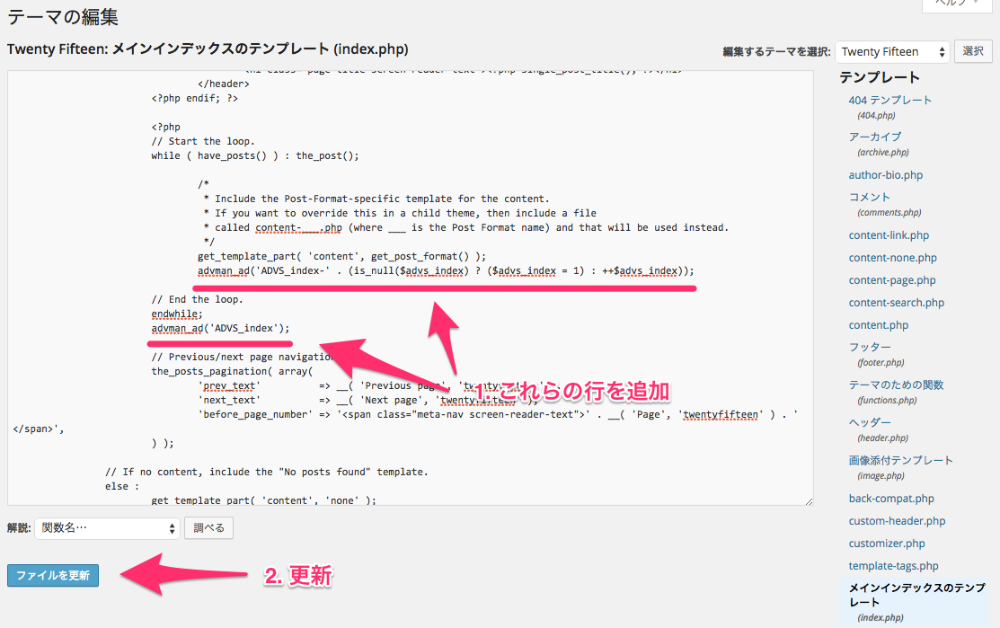
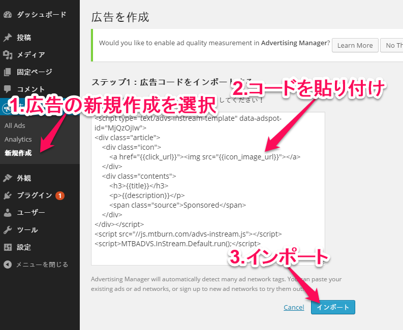
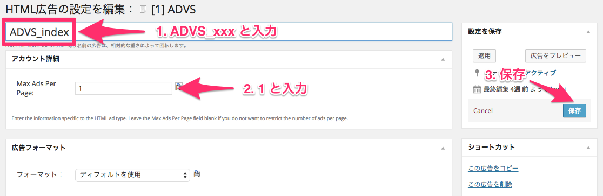

# Index
- [Step1:Install “Advertising Manager” which is WordPress plugin](#install)
  - [1)Install "Advertising Manager"](#install1)
  - [2)Activate "Advertising Manager"](#install2)
- [Step2:Set up “Advertising Manager”](#setup)
  - [1)Edit theme](#setup1)
    - [Add code on template](#setup1-1)
  - [2)Ad spot setting on “Advertising Manager”](#setup2)
    - [Set ad template and ad call script](#setup2-1)
    - [Set up the tag which assign ad placement](#setup2-2)


This socument show how to implement tag on WordPress using plug-in.


<a name="install"></a>
# Step 1 : Install “Advertising Manager” which is WordPress plugin

<a name="install1"></a>
## 1)Install "Advertising Manager"

General ways are as followings;。

### A)How to search the plugin on UI and install

- On the UI of WordPress, you can see the section named “Plugins>Add new” on the left side, then click on that section and Search for ”advertising-manager”
- Might find out ”Advertising Manager” by Scott Switzer
- Click “now install” button then the installation finished.


### B)How to select the plug-in zip file and install

- Download the plugin zip file from [WordPress plugin「Advertising Manager」](https://wordpress.org/plugins/advertising-manager/)
- On the UI of WordPress, you can see the section named ”Appearance>Edit” on the left side then, click on that section and select “upload plugin”.
- Select the zip file, click button “Install now”


### C)How to upload plug-in directly on server

- •	Download the plugin zip file from [WordPressplug-in「Advertising Manager」](https://wordpress.org/plugins/advertising-manager/).
- Upload the zip file on the “wp-contents/plugins” directory “wp-contents/plugins” which is installed via Wordpress
- Extract the zip file





<a name="install2"></a>
## 2)Activate ”Advertising Manager”

On the UI of WordPress, you can see the section named ”Plugins>Installed plugins” on the left side then click on that section and activate “Advertising Manager”.


<a name="setup"></a>
# Step 2: Set up “Advertising Manager”

<a name="setup1"></a>
## 1)　Edit theme

Add the code where you would like to make new ad spot by editing the theme.

Ex) After installation, many templates are shown on feed list at the initial stage. In this case, there are 3 templates as per belowl。

- Main index template (index.php)
- Search template (search.php)
- Archive template (archive.php)





<a name="setup1-1"></a>
### Add code on template

- On the UI of WordPress, you can see the section named”Appearance>Edit” on the left side then click on that section and select the template that you would like to edit(``index.php``or``search.php``、``archive.php`` etc...)
- Add 2 code per details below
  - Add the following code on the line just before the end of the loop
    - `advman_ad('ADVS_xxx-' . (is_null($advs_xxx) ? ($advs_xxx = 1) : ++$advs_xxx));`
      - `xxx` : Set optional name depend on contents. Ex)index page => `ADVS_index`
      - Can use Alphanumeric only for `xxx`
  - Add following code on the line after loop termination
    - `advman_ad('ADVS_xxx');`
- Press “Update File” button  then finish to edit editing template

 Sample：Adding the code on `index` template

```php
	// Start the Loop.
	while ( have_posts() ) : the_post();

		/*
		 * Include the Post-Format-specific template for the content.
		 * If you want to override this in a child theme, then include a file
		 * called content-___.php (where ___ is the Post Format name) and that will be used instead.
		 */
		get_template_part( 'content', get_post_format() );

		advman_ad('ADVS_index-' . (is_null($advs_index) ? ($advs_index = 1) : ++$advs_index));	// ←Add this code.

	// End the loop.
	endwhile;
	advman_ad('ADVS_index');													// ←Add this code.
```




<a name="setup2"></a>
## 2) Ad spot setting on “Advertising Manager”

<a name="setup2-1"></a>
### Set ad template and ad call script

#### Create tag for template

Create tag for template. It is necessary to make different templates on each media. Please refer [here](https://github.com/mtburn/MTBurn-JavaScript-SDK-Install-Guide/blob/master/Programming_Guide_English.md#infeed/start/template) for the access of further details.  

Sample: Tag for template

```html
<div class="article">
	<div class="icon">
		<a href="{{click_url}}"></a>
	</div>
	<div class="contents">
		<h3>{{title}}</h3>
		<p>{{description}}</p>
		<span class="source">Sponsored</span>
	</div>
</div>
```

Please refer [here](https://github.com/mtburn/MTBurn-JavaScript-SDK-Install-Guide/blob/master/Programming_Guide_English.md#infeed/parameter) to know which placeholders you can use. 

#### Draft ad template tag and ad call script

On the UI of WordPress, you can see the section named “plug in(Ads>Create new)” on the left side then click on that section and paste the following code then and import.

```html
<script type="text/advs-instream-template" data-adspot-id="広告枠ID">
<!-- Paste the template that make in above section -->
</script>
<script src="//js.mtburn.com/advs-instream.js"></script>
<script>MTBADVS.InStream.Default.run();</script>
```



- Paste the template in above section on the area `“Paste the template that make in above section”`. When you would like to assign number of text, need to set in this point. Please refer [here](https://github.com/mtburn/MTBurn-JavaScript-SDK-Install-Guide/blob/master/Programming_Guide_English.md) to know more detail.
- Set ad spot ID that registered on admin UI on `ad spot ID`.


After import, move"Edit Settings for HTML Ad"

- Change `HTML` to `ADVS_xxx` 
  - Change `xxx` to [previousinput name](#setup1). For the current example name is `ADVS_index`.
- Fill in “1” on the box ” Account Details > Max Ads Per Page”
- Click  “save” button and the registration completed.




<a name="setup2-2"></a>
### Set up the tag which assign ad placement

On the UI of WordPress, you can see the section named “plug in(Ads>Create new)” on the left side then click on that section and paste the following code then and import. 

```html
<div data-advs-adspot-id="ad spot ID" style="display:none"></div>
```


-Enter the ID that registered on admin UI on `ad spot ID` which is the same ID with ad template’s.。

After import, move"Edit Settings for HTML Ad"。

- Change `HTML` to `ADVS_xxx-<ad display position>` 
  - Change `xxx` to [previous input name](#setup1). The current sample name is `ADVS_index`.
  - Enter only the integer on `<ad display position>`. Note that the ads will be automatically displayed in the next below section
- Click “save” button and the registration completed


In case you would like to create more ad spots, please repeat the same instructions and procedures [Set up the tag which assign ad placement](#setup2-2) again.


**Setting is completed.**

Check if infeed ad displayed on template section.
