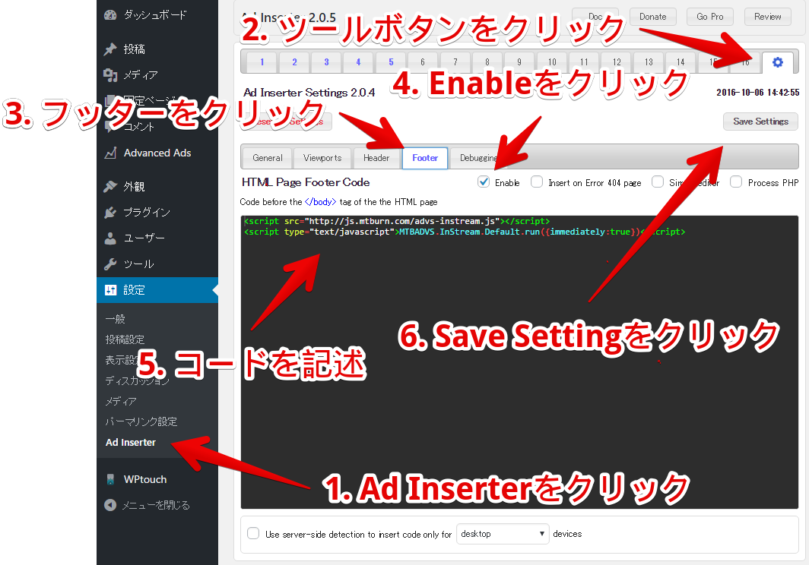
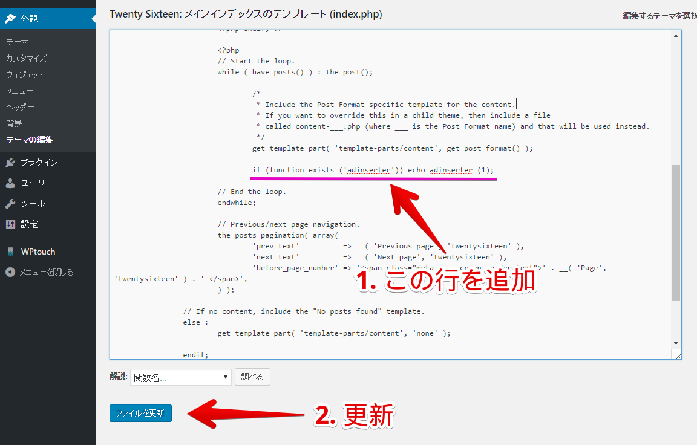

# 目次
- [事前に準備するもの](#prerequisite)
 - [広告枠ID](#prerequisite1)
- [WordPressプラグインのインストール](#install)
 - [プラグインをインストールする](#install1)
 - [プラグインを有効にする](#install2)
 - [Advanced Ads Pro の購入方法](#install3)
- [「Ad Inserter」をインストールした場合](#setup1)
 - [「Ad Inserter」の共通設定 - 広告表示実行コードを登録](#setup1-1)
 - [広告を title と content の間に出力する方法 (テーマ編集なし)](#setup1-2)
   - [広告設置位置指定タグの設定](#setup1-2-1)
 - [広告を post と post の間に出力する方法 (テーマ編集あり)](#setup1-3)
   - [広告設置位置指定タグの設定](#setup1-3-1)
   - [テンプレートへのコードの追加](#setup1-3-2)
- [「Advanced Ads Pro」をインストールした場合](#setup2)
 - [広告を post と post の間に出力する方法 (テーマ編集なし)](#setup2-1)
   - [広告設置位置指定タグの設定](#setup2-1-1)


# 目的
- WordPress にプラグインを用いてインフィード広告を導入する方法を説明します。
- 紹介するプラグインは「Ad Inserter」と「Advanced Ads Pro(有料版)」になります。
- プラグインのインストール方法は「Ad Inserter」のみで解説しますが基本作業はどちらも同じです。

<a name="prerequisite"></a>
# 事前に準備するもの

<a name="prerequisite1"></a>
## 広告枠ID
管理画面で広告枠の新規登録を行い``広告枠 ID`` を準備してください。


<a name="install"></a>
# WordPressプラグインのインストール

<a name="install1"></a>
## プラグインをインストールする

- 一般的なやり方は下記の3通りになります。
- 以下、「Ad Inserter」を例にしていますが、「Advanced Ads」の場合も名前を変えて同じ手順を行います。

### WordPress管理画面上でプラグイン検索してインストールする方法

- WordPress管理画面の「プラグイン＞新規追加」で「ad inserter」を検索する
- Igor Funa作の「Ad Inserter」を「いますぐインストール」でインストールする


### プラグインのZIPファイルを指定してインストールする方法

- [WordPressプラグイン「Ad Inserter」](https://wordpress.org/plugins/ad-inserter/)からプラグインのZIPファイルをダウンロードする
- WordPress管理画面の「プラグイン＞新規追加」で「プラグインのアップロード」を選択する
- プラグインのZIPファイルを指定して「いますぐインストール」でインストールする


「プラグインのアップロード」を選択すると下図のように展開する


### サーバに直接アップする方法

- [WordPressプラグイン「Ad Inserter」](https://wordpress.org/plugins/ad-inserter/)からプラグインのZIPファイルをダウンロードする
- ZIPファイルを解凍したディレクトリの中に「ad-inserter」という名前のディレクトリができる
- 「ad-inserter」ディレクトリを WordPressがインストールされているディレクトリの `wp-contents/plugins`ディレクトリにアップロードする
 - アップロードにはFTPアプリケーションなどをご利用ください


<a name="install2"></a>
## プラグインを有効にする

WordPress管理画面の「プラグイン＞インストール済みプラグイン」で Ad Inserter を「有効」にしてください。


<a name="install3"></a>
## Advanced Ads Pro の購入方法

プラグインの設定画面より購入ページへ遷移して購入してください。


<a name="setup1"></a>
# 「Ad Inserter」プラグインで広告を表示する

<a name="setup1-1"></a>
## 「Ad Inserter」の共通設定 - 広告表示実行コードを登録

WordPress管理画面の「設定＞Ad Inserter」から以下の手順で登録を行います。

1. 「Tab16」の右にある「空白タブ」をクリック
2. 設定画面のタブから「Footer」をクリック
3. Enable にチェックを入れ以下2行を追加
```html
<script src="http://js.mtburn.com/advs-instream.js"></script>
<script type="text/javascript">MTBADVS.InStream.Default.run({immediately:true})</script>
```
4. 「Save Settings」をクリック



<a name="setup1-2"></a>
## 広告を title と content の間に出力する方法 (テーマ編集なし)

<a name="setup1-2-1"></a>
### 広告設置位置指定タグの設定

WordPress管理画面の「設定＞Ad Inserter」からコードを登録してください。
- Automatic Display に 「Before Content」 を選択します。
- Postsにチェックを入れ「On all」を選択します。
- Block Aliggnment に 「No Wrapping」 を選択します。
- 「Homepage」, 「Category」, 「Search page」, 「Tag/Archive pages」 をチェックします。
- 広告コードを登録します。`広告枠ID` の部分には管理画面で発行した[広告枠ID](#prerequisite1)を入力してください。
- 「Save All Settings」を押して登録を完了してください


**Ad Inserter の title と content の間に出力する設定は完了です。**

一覧ページで title と content の間に広告が表示されているかを確認してください。


<a name="setup1-3"></a>
## 広告を post と post の間に出力する方法 (テーマ編集あり)

<a name="setup1-3-1"></a>
### 広告設置位置指定タグの設定

WordPress管理画面の「設定＞Ad Inserter」からコードを登録してください。
- 「Manual」を選択します。
- Automatic Display に 「None」 を選択します。
- Postsにチェックを入れ「On all」を選択します。
- Block Aliggnment に 「No Wrapping」 を選択します。
- 「Homepage」, 「Category」, 「Search page」, 「Tag/Archive pages」 をチェックします。
- 広告コードを登録します。`広告枠ID` の部分には管理画面で発行した[広告枠ID](#prerequisite1)を入力してください。
- 「PHP function」をチェックします。
- 「PHP function」の右のコードをメモします。
 - `if (function_exists('adinserter')) echo adinserter(1);`
- 「Save All Settings」を押して登録を完了してください
- 完了後、一覧ページで post と post の間に広告が表示されているかを確認してください。


同じフィード内にさらに広告を設置する場合は必要個数分追記してください。

<a name="setup1-3-2"></a>
### テンプレートへのコードの追加

テーマを編集し、広告を表示させたいフィード部分にコードを追加します。

例として、WordPressインストール初期状態のフィード一覧ページのテンプレートは以下の 4 つですがテーマによっては存在しないテンプレートもあります。

- メインインデックステンプレート (``index.php``)
- 検索結果テンプレート (``search.php``)
- アーカイブテンプレート (``archive.php``)
- カテゴリーテンプレート (``category.php``)


<a name="setup1-1-1"></a>
### テンプレートへのコードの追加

- WordPress管理画面の「外観＞テーマの編集」で、編集するテンプレート(``index.php``や``search.php``、``archive.php``、``category.php`` など)を選択してください
- 下記を参考に 1 行のコードを追加してください
  - ループの終了直前の行に前項でメモしたコードを追加してください
    - `if (function_exists('adinserter')) echo adinserter(1);`
- 「Save All Settings」を押してテンプレートの編集を終了してください

`index` のテンプレートにコードを追加する例

```php
// Start the loop.
while ( have_posts() ) : the_post();

      /*
       * Include the Post-Format-specific template for the content.
       * If you want to override this in a child theme, then include a file
       * called content-___.php (where ___ is the Post Format name) and that will be used instead.
       */
      get_template_part( 'template-parts/content', get_post_format() );

      if (function_exists ('adinserter')) echo adinserter (1);

// End the loop.
endwhile;
```




**Ad Inserter のpost と post の間に出力する設定は完了です。**

変更したテンプレートの画面で、インフィード広告が表示されるかご確認ください。
